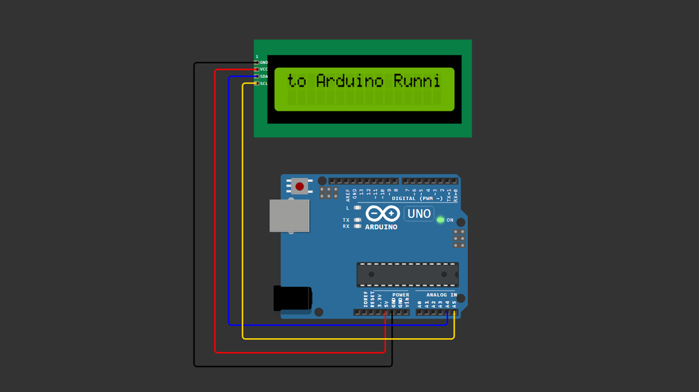

# Arduino LCD I2C Running Text

This Arduino project demonstrates how to create **continuous running text (scrolling text)** on a **16x2 LCD with an I2C module**.

This is a beginner friendly Arduino project and a great continuation after the **LCD Hello World** tutorial.

---

## Components Required

- Arduino Uno
- LCD 16x2 with I2C module
- Jumper wires
- USB cable

---

## Wiring Connections

| LCD I2C | Arduino |
|--------|--------|
| GND | GND |
| VCC | 5V |
| SDA | A4 |
| SCL | A5 |

---

## 📷 Wiring Diagram

> Make sure your wiring matches the diagram above before uploading the code.

---

## 💻 Arduino Code

You can download the Arduino sketch here:

[Download Arduino Code](Arduino_LCD_I2C_Running_Text.ino)

Or open the `.ino` file directly inside this repository.

---

## Library Required

Install this library from **Arduino Library Manager**:

---

## 🎥 Video Tutorial

Watch the full step-by-step tutorial on YouTube:

👉 https://youtu.be/Q7-rjlNKob8

---

## 📄 License

This project is open-source and free to use for educational purposes.

---

Happy Coding 🚀
